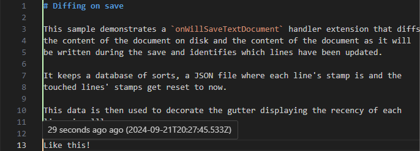

# Diffing on save

This sample demonstrates a `onWillSaveTextDocument` handler extension that diffs
the content of the document on disk and the content of the document as it will
be written during the save and identifies which lines have been updated.

It keeps a database of sorts, a JSON file where each line's stamp is and the
touched lines' stamps get reset to now.

This data is then used to decorate the gutter displaying the recency of each
line visuallly.

Like this:

