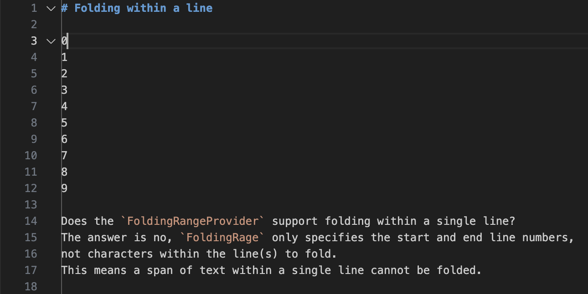
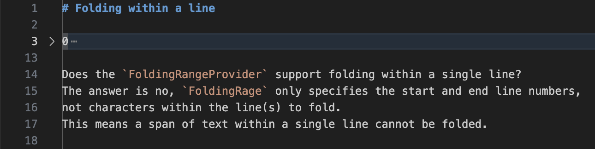

# Folding within a line

0
1
2
3
4
5
6
7
8
9

Does the `FoldingRangeProvider` support folding within a single line?
The answer is no, `FoldingRage` only specifies the start and end line numbers,
not characters within the line(s) to fold.
This means a span of text within a single line cannot be folded.

Unfolded:

Folded:

