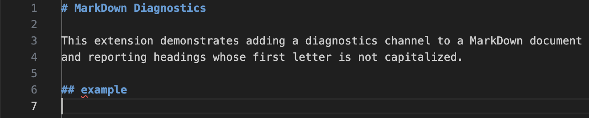
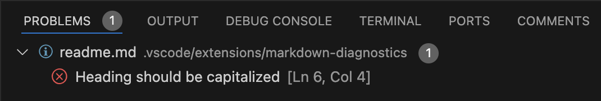

# MarkDown Diagnostics

This extension demonstrates adding a diagnostics channel to a MarkDown document
and reporting headings whose first letter is not capitalized.

Document:

Problems pane channel:

