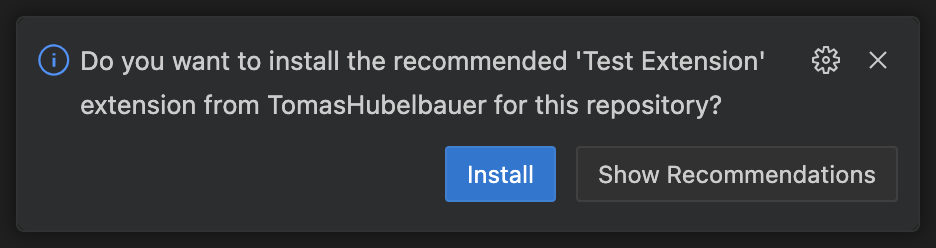
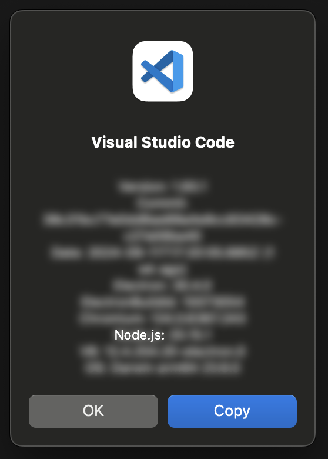
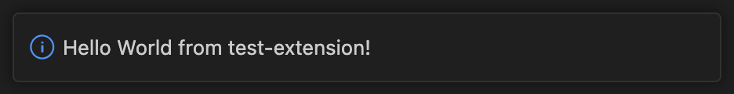

# VS Code extension playground

This repository contains a barebones local workspace VS Code extension.

Local workspace extensions are a VS Code feature where an extension can run off
its source code directly, without needing to be installed from a VSIX or the
VS Code extension marketplace.

This feature has been a part of VS Code since the version 1.89:
https://code.visualstudio.com/updates/v1_89#_local-workspace-extensions

Local workspace extension needs to be installed once and VS Code will prompt you
to install it once it discovers it in the `.vscode/extensions` directory:



There is no need to add the extension to `.vscode/extensions.json` under the
`recommendations` key.

Once installed, VS Code will not prompt you to install it again and it will
behave like any other regular VS Code extension.

The local workspace extension gets refreshed whenever VS Code restarts, so any
code changes will only take effect using the Cmd+Shift+P command palette command
*Developer: Reload Window*.

The extensions can make use of all VS Code extension APIs and they can read
both user and workspace settings (`.vscode/setting.json`).

See the VS Code extension API reference here:
https://code.visualstudio.com/api/references/vscode-api

Local workspace VS Code extensions do not support ESM yet, there is a tracking
ticket for this in the VS Code GitHub project:
https://github.com/microsoft/vscode/issues/130367

It relies on an internal VS Code dynamic loader and its support for ESM:
https://github.com/microsoft/vscode-loader/issues/36

For now, CJS' `require` and `module.exports` is used instead.

Other than ESM, what other ES features can be used is determined by the Node
version bundled with VS Code as that is what the extension hose process runs on.
You can find the Node version your install of VS Code uses by going to Code >
About Visual Studio Code in the top bar of the window.



Problems with extension development can be debugged using the Ouput pane in the
VS Code bottom panel under the Extension Host output channel.

This output channel will print errors that occured during the extension's
activation:

```
[error] Activating extension TomasHubelbauer.test-extension failed due to an error:
[error] …/vscode-extension-playground/.vscode/extensions/test-extension/extension.js
…
```

In case there is no error, the extension will activate and log a success info:

```
[info] ExtensionService#_doActivateExtension TomasHubelbauer.test-extension, startup: false, activationEvent: 'onStartupFinished'
```

As it stands, this sample extensions displays an information message once it
loads up and does nothing else:


